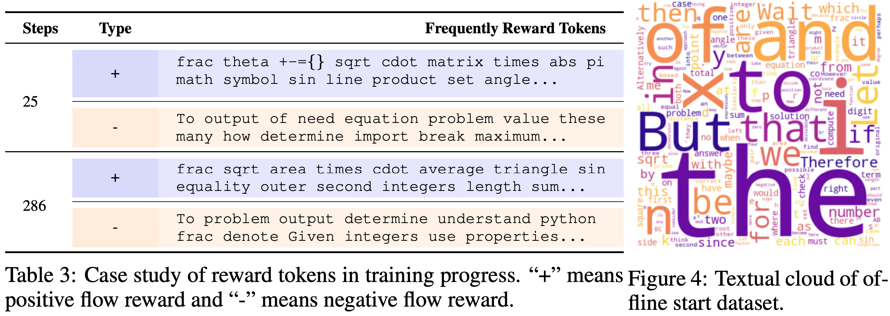

<div align="center">
<h1 align="center"> RLFR: Extending Reinforcement Learning for LLMs with Flow Environment</h1>

<a href='https://arxiv.org/abs/2506.18254'></a>
<a href='https://codegoat24.github.io/UnifiedReward/Pref-GRPO'></a>
[](https://huggingface.co/collections/openbmb/rlpr-6857fa5d22cbe64327a3f8f6)
<a href='https://huggingface.co/datasets/openbmb/RLPR-Train-Dataset'></a>

</div>

## 🔥 News
- [2025.10.10] 🔥🔥 We release the [paper](https://github.com/JingHao99/RLFR), [models](https://github.com/JingHao99/RLFR), [dataset](https://github.com/JingHao99/RLFR), and codebase of RLFR.

## 📜 Brief Introduction
We introduce the RLFR that offering a novel perspective on shaping RLVR with flow rewards derived from latent space, and thus extending RLVR with latent rewards utilization. Our approach highlight the much underexplored yet highly expressive latent space and the sound flow environment.

💡 **Stronger Reasoning Enhancement.** RLFR shows consistent progress in advancing reasoning capabilities over RLVR with binary verification and entropy based shaping method with signal collected from logit space.
<div align="center">  </div>

🛠️ **Simple and Reliable Reward.** RLFR establishes the flow fields of policy latents from either off-policy high-quality data and on-policy rejection sampling data, and the velocity deviations of policy latents within it are quantified to serve as a reward signal.
<div align="center">  </div>

📈 **Reward Behavior Analysis.** Flow rewards enable *expert off-policy data as reference* for constituting reward signal.
Beyond that, flow rewards *prefer tokens that practically execute the question*, rather than connection token, which is different from entropy perspective. Additionally, flow reward is capable of relying on *efficient context dependence compressed within the hidden states*, rather than individual token-level denotation for context comprehending. Please refer to our paper for more details.
<div align="center">  </div>

## 🔧 Environment Set Up
1. Clone this repository and navigate to the folder:
```bash
git clone https://github.com/JingHao99/RLFR.git
cd RLFR
```
2. Install dependency:
```bash
# Install uv if you don't have it already
pip install uv

# Create a virtual environment and install dependencies
python3 -m venv .venv

# Activate the virtual environment
# For macOS/Linux
source .venv/bin/activate
# For Windows
.venv\Scripts\activate

# Install RLFR with main dependencies
uv pip install -e .
# Install LLaMA-Factory for flow training (Optional)
uv pip install -e ./LLaMA-Factory --no-deps
# Install RLFR for eval dependencies (Optional)
uv pip install '.[eval]'
```

## 💻 Training

#### 1. Prepare data

Download the [RLFR-Dataset-LM](https://huggingface.co/datasets/JingHaoZ/RLFR-Dataset-LM) and [RLFR-Dataset-VLM](https://huggingface.co/datasets/JingHaoZ/RLFR-Dataset-VLM) dataset. Move to `./datasets/RLFR-Dataset-LM` and `./datasets/RLFR-Dataset-VLM`, respectively. The LM and VLM settings are optional choices.
```bash
huggingface-cli download --repo-type dataset --resume-download JingHaoZ/RLFR-Dataset-LM --local-dir ./datasets/RLFR-Dataset-LM
huggingface-cli download --repo-type dataset --resume-download JingHaoZ/RLFR-Dataset-VLM --local-dir ./datasets/RLFR-Dataset-VLM
```
#### 2. Flow Training
Specify the base model path in `./LLaMA-Factory/examples/train_flow/*_flow.yaml`, and set the running yaml file in `./LLaMA-Factory/run_flow.sh`. Users are friendly to adjust flow settings for attempting different flow environment, including *hook_layers_percentile*, *flow_context_mode*, etc. Default settings are provided in yaml.
```bash
bash LLaMA-Factory/run_flow.sh
```
- After training, extract the flow model from checkpoint, and specify the checkpoint path for `ckpt-dir`. The extractrd `flow_model.bin` will be placed in the original path, and the LLM checkpoint are free to delete.
    ```shell
    python convert_state_dict.py --ckpt-dir path_to_ckpt_dir
    ```

#### 3. RL Training
Specify the base model path and flow path in `openrlhf/scripts/train_ray_RLFR_*.sh`, run the training scipt.
```bash
bash openrlhf/scripts/train_ray_RLFR_lm_qwen2.5_7B.sh     # For example
```
- **Resume Training.** If you need to continue training from a specific training step, specify the `PRETRAIN_MODEL_PATH` and `PRETRAINED_FLOW` to the corresponding checkpoint directory and then rerun the training script.

### 🚀 Evaluation
For language benchmarks, specify the `MODEL_PATH` in  `eval/lm_eval/eval.sh`, and then run the script.
```bash
bash eval/lm_eval/eval.sh
```
For multimodal benchmarks, download the benchmark datasets at `eval/vlm_eval/benchmark`, specify the `RUN_NAME` and `CKPT` in  `eval/vlm_eval/vlmserver_run.sh`.
- If use local judge, specify the `LOCAL_LLM` path in `.env`, and `lmdeploy serve` in `eval/vlm_eval/vlmserver_run.sh`. 
- If use api judge, specify the deployed `API_URL` in `eval/vlm_eval/vlmserver_run.sh`, such as deepseek-v3-0324 in default, and set the `LOCAL_LLM` path in `.env` as none. More configurations refer to [VLMEvalKit](https://github.com/open-compass/VLMEvalKit/blob/main/docs/en/Quickstart.md).
```bash
bash eval/vlm_eval/vlmserver_run.sh
```

## 🎓 Acknowledgements
This work is supported by [SII](https://www.sii.edu.cn/main.htm) for computing resources.

We acknowledge the outstanding open-source contributions from [OpenRLHF](https://github.com/OpenRLHF/OpenRLHF), [LLaMA-Factory](https://github.com/hiyouga/LLaMA-Factory/tree/main) for building our training codebase, and [VLMEvalKit](https://github.com/open-compass/VLMEvalKit), [Understand-R1-Zero](https://github.com/sail-sg/understand-r1-zero/tree/main) for developing our evaluation pipeline.

Thanks to all the contributors!

## ⭐ Citation
Please leave us a star ⭐ if you find this work helpful, and consider cite our paper!
```
@article{
}
